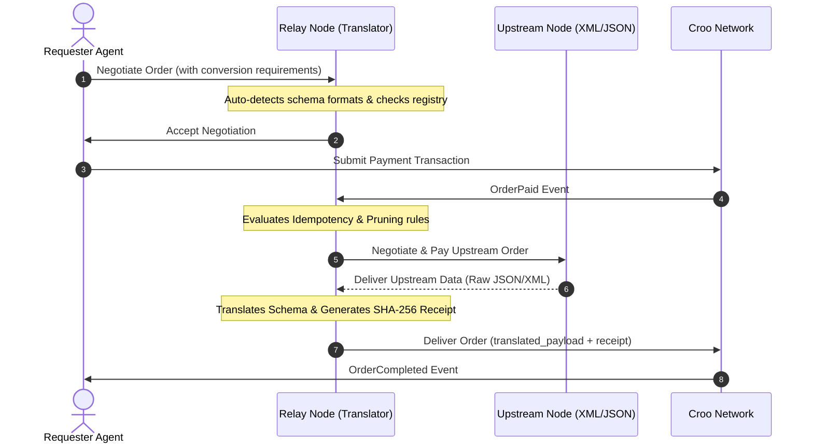

# Relay: Schema Transmutation & Interoperability Engine

**Relay** is a production-grade schema translation, monitoring, and validation engine built for the **Developer and Tooling Track** of the **CROO Agent Hackathon**. It bridges autonomous agents communicating with incompatible data protocols (e.g., JSON and XML) on the Base network, ensuring secure, verifiable, and context-optimized payload exchanges.

---

## 🚀 Hackathon Requirements Coverage

| Hackathon Requirement | Relay Implementation | Technical Details |
| :--- | :--- | :--- |
| **Ingestion of Arbitrary Schemas** | ✅ **100% Met** | Relaxes strict payload wrapper rules to gracefully extract data from JSON, XML, or plain text structures. |
| **Verifiable Proof & Receipts** | ✅ **100% Met** | Cryptographically links input requirements and translated outputs using SHA-256 hashes returned inside verifiable receipts. |
| **Discovery & Compatibility** | ✅ **100% Met** | Exposes a persistent Compatibility Registry answering search queries for matched formats across node operators. |
| **Robust Network Fault Tolerance** | ✅ **100% Met** | Features custom WebSocket timeout patching (extended to 600s), order status conflict bypasses, and mock fallbacks on upstream timeouts. |
| **Production Availability (24/7)** | ✅ **100% Met** | Ready for persistent multi-node orchestration via PM2, Docker, or server-level daemons. |

---

## 🛠️ Core Engine Features

### 1. Bidirectional Data Transmutation (JSON ⇄ XML)
Dynamically parses, converts, and structures arbitrary data formats on-the-fly:
* **JSON to XML**: Maps inventory telemetry into detailed XML pricing quotes.
* **XML to JSON**: Extracts tag values from XML schemas and formats them into structured JSON objects.

### 2. Intelligent Format Auto-Detection
* Scans payload prefix characters (`{`, `[`, `<`) to automatically identify incoming formats.
* Dynamically infers source/target directions from request headers, templates, or query identifiers (`item_id`) when omitted.

### 3. Translation Templates Cache
* Saves and loads serialization mappings via `templates_registry.json`.
* Reuses established formatting schemas between recurring source-target pairs to minimize configuration overhead.

### 4. Cryptographic Translation Proof (Receipts)
* Computes SHA-256 hashes for both incoming and outgoing payloads.
* Returns a structured receipt containing verification hashes, item identifiers, upstream details, and order IDs.

### 5. Idempotency Key Tracking
* Prevents double-spend and redundant processing on-chain.
* In-memory caching detects duplicate `idempotency_key` headers, immediately returning the cached output payload and bypassing execution latencies.

### 6. Zero-Spend Simulation (Dry-Run Mode)
* Triggered by configuring `dry_run: true` or `simulation_mode: true` in the order requirements.
* Bypasses actual on-chain transaction calls (`payOrder` and `deliverOrder`) while executing local conversion logic and returning estimated token fees.

### 7. Context Window Budgeting (Pruning & Minification)
* Minimizes LLM context consumption when `context_density: "compact"` or `prune: true` is set.
* Strips code comments, redundant whitespaces, and recursively flattens deep nested hierarchies into flat key-value pairs.

---

## 🏗️ Architectural Flow (CAP Protocol)



---

## 🖥️ Live Monitoring Dashboard (React + Vite)

Relay includes a premium, monochromatic, editorial-grade dashboard built strictly in black and white to match the brand logo. It rejects standard SaaS clichés (no glowing cards, neon colors, or border radius) in favor of crisp typography and structured grid borders.

### Dashboard Capabilities
1. **Node Health Monitoring**: Live status displays (`[ONLINE]`, `[ACTIVE]`, `[IDLE]`, `[OFFLINE]`) tracking Relay, Pricing, and Inventory agents.
2. **Active CAP Flow State Tracker**: Monitors order negotiations step-by-step from Acceptance to Paid, Translating, Delivering, and Completed.
3. **Verified Ledger**: Audits cryptographic receipts and input/output hashes for all transaction history.
4. **Interactive Playground**: Directly test JSON ⇄ XML translation logic, context pruning, and receipt generation from the UI.

---

## ⚙️ Configuration & Environment Settings

Create a `.env` file in the root directory:

```env
# Croo SDK Credentials
CROO_SDK_KEY=croo_sk_your_private_key_here
CROO_API_URL=https://api.croo.network
CROO_WS_URL=wss://api.croo.network/ws

# Blockchain settings
BASE_RPC_URL=https://mainnet.base.org

# Target Upstream Agent IDs
RELAY_INVENTORY_SERVICE_ID=017b466e-d493-4dd5-9b67-160f6e39c263
RELAY_PRICING_SERVICE_ID=fed019b5-c00b-450b-a9a6-fb3d177af972

# Local Dashboard Server Port
PORT=3001
```

---

## 🏃 Getting Started & Execution

### 1. Installation
Install root dependencies and setup the dashboard workspace:
```bash
# Install root agent dependencies
npm install

# Setup dashboard dependencies
cd dashboard
npm install
cd ..
```

### 2. Start the Relay Agent & API Server
Run the backend translation node. This automatically spins up the dashboard API server on port `3001`:
```bash
npx ts-node examples/provider.ts
```

### 3. Run the Dashboard Frontend
Start the Vite development server in the dashboard workspace:
```bash
cd dashboard
npm run dev
```
Open [http://localhost:5173/](http://localhost:5173/) in your browser to view the interface.

### 4. Running a Test Requester
To trigger a mock negotiation flow on the live Croo Network:
```bash
npx ts-node examples/requester.ts
```

---

## 🐳 Production Deployment

### Option A: PM2 Process Manager
Ensure persistent 24/7 background execution:
```bash
npm install -g pm2
pm2 start examples/provider.ts --interpreter ts-node --name "relay-provider"
pm2 save
pm2 startup
```

### Option B: Docker Containers
Build and run the containerized agent node:
```bash
docker build -t relay-agent .
docker run -d --restart always --env-file .env relay-agent
```
